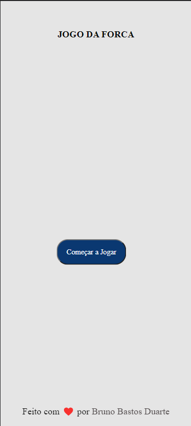
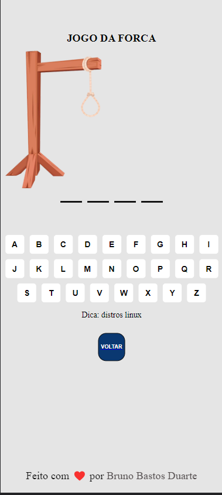
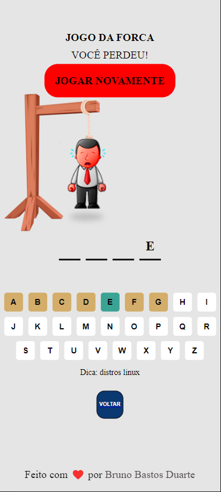
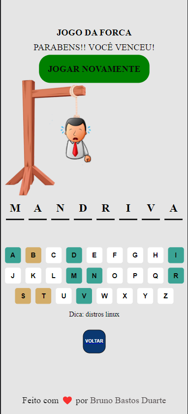

# Decodificador

## 🚀 link para o projeto no ar [aqui](https://vits56.github.io/jogo-da-forca/)

## Screenshot

 
  
  
  
  

 

# Sobre o projeto

Projeto realizado durante o Oracle Next Education realizado pela Oracle + Alura. Foi desenvolvido uma aplicação de jogo da forca.

## 🧑‍💻 Tecnologias utilizadas

- [HTML](https://developer.mozilla.org/pt-BR/docs/Web/HTML)
- [CSS](https://developer.mozilla.org/pt-BR/docs/Web/CSS)
- [JavaScript](https://developer.mozilla.org/pt-BR/docs/Web/JavaScript)

## Requisitos

## Extras

# Executando a aplicação

Primeiramente clone o repositório para sua maquina ou faça o 'download' em formato ZIP e descompacte. Para realizar a clonagem do repositório utilize o comando:

    git clone https://github.com/vits56/jogo-da-forca.git

Após basta abrir a pasta e dar dois cliques no arquivo:

    index.html

# Autor

Made with 💜 by <a href="https://github.com/vits56" target="_blank">Bruno Bastos Duarte</a>

&#xa0;

<a href="#top">Back to top</a>